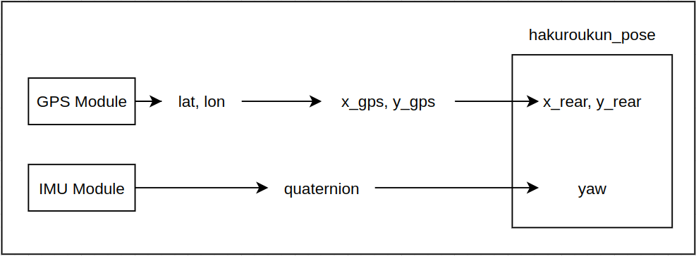

# Magic number explain

Line 71 : `self.gps_to_rear_axis = 0.6`

- This describe the distance between gps to 

Line 73 : `self.imu_offset = 0.2526352784505572`

- At bring up, when yaw = 0, imu has an offset.
- imu data raw -> quaternion (how did they measure this?)
- why this offset exists?

- Quaternion data was sent directly in tsnd151_node from IMU data
- Without the calibration steps, quaternion might have an offset.

Line 250 : `current_orientation += (angular_rate + 0.36) * dt`
- This 0.36 this measure manually.
- When the imu data is on, 2 data msg is sent with a sampling time(dt)
- Not every 2 msg is sent with the same dt, sometime slower or faster -> The heading angle is calculated wrong,
- by +0.36 into angular_rate, the heading angle is calculated more accurate.

---
`rotation_angle ` : from latitude and longitude -> x,y -> x_local, y_local 

**Questions**
- why there exist an angle?
- how did they change from lat,lon to x,y

**Answer**

For (lat, lon, origin_lat, origin_lon) -> x,y :
Latitude and Longitude is projected on earth surface into coordinates
for (lat, lon) -> (x_earth_surface, y_earth_surface)
- x is Easting in m (local grid)
- y is Northing in m  (local grid)

Then, having an x_origin_earth, y_origin_earth

- x_gps = x_earth_surface - x_origin_earth (Easting)
- y_gps = y_earth_surface - y_origin_earth (Northing)

**Conclusion** : In our local map, the local map x,y axis having an rotation angle with x_earth, y_earth (easting, northing)

# Hakuroukun Pose explain
- Using raw data from Sensors(GPS, IMU) and convert them to robot position and heading.

## Subscribed Topics
"/fix", NavSatFix

"/imu/data_raw", Imu
## Published Topics
"/hakuroukun_pose/rear_wheel_position", PoseStamped

"/hakuroukun_pose/orientation", Float64
## Parameters